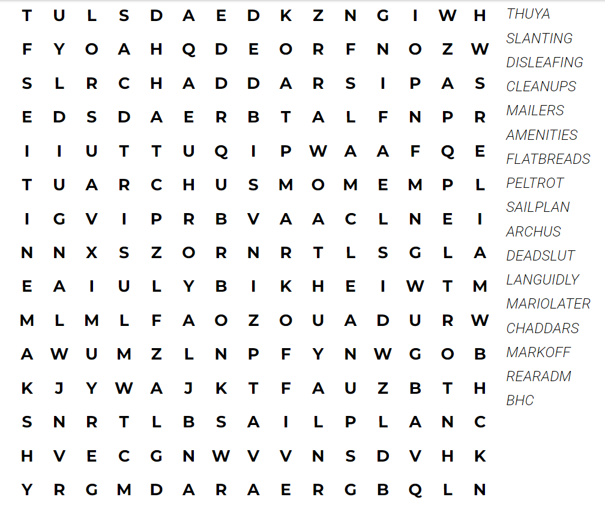
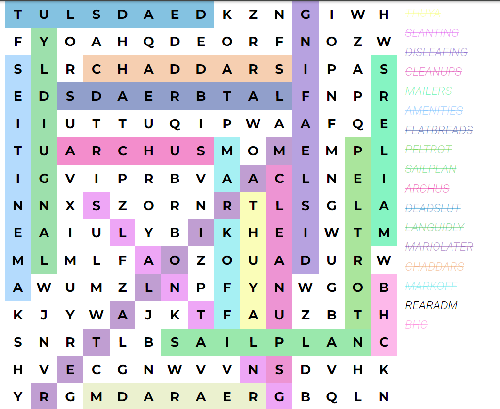
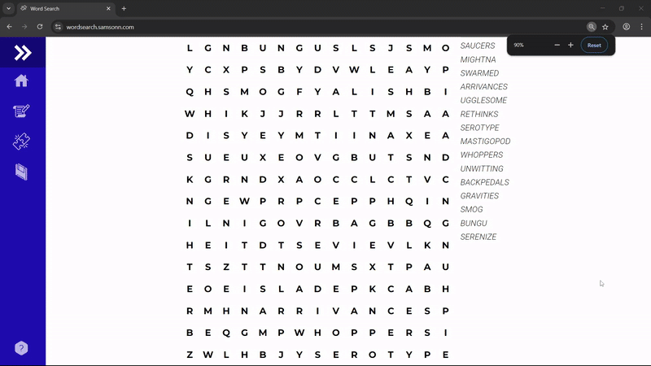

# 🔍 Automated Word Search Solver Bot

This project is a fully automated bot that solves online word search puzzles in real time. It scrapes the DOM from the game page, detects words using a **Trie data structure**, and simulates human-like drag gestures using **Selenium WebDriver** to input the correct answers.

---

## 📸 Screenshots

| Initial Grid           | Solving In Action      |
|-----------------------|-----------------------|
|  |  |

---

## 🎬 Bot in Action



---

## ⚙️ How to Run Locally

```bash
# 1. Clone the repository
git clone https://github.com/Lazarus-10/wordsesarch_bot.git
cd wordsearch-bot

# 2. Install dependencies
pip install -r requirements.txt

# 3. Run the bot
python wordsearch_bot.py 
```